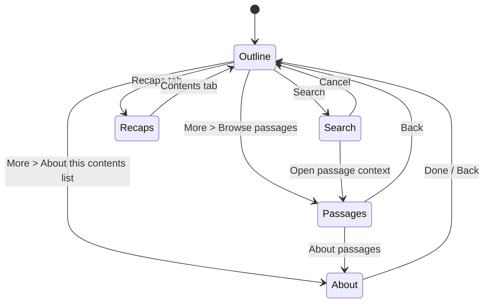

# Contents Navigation Redesign V2: Scan First, Detail on Demand

## Status

- Implementation in progress as of 2026-08-23. The working reader already has
  the V2 outline/passages/search/recaps/About model; this document now records
  the remaining validation and accessibility work rather than describing the
  whole feature as hypothetical.
- `src/components/Reader/SidebarV2.tsx` owns the implementation. `Sidebar.tsx`
  remains a compatibility re-export for existing imports.
- The reader session already owns responsive modal/rail coordination in
  `Reader.tsx`; focus, resize, and density acceptance still need verification.
- This plan supersedes the interaction and information-hierarchy decisions in `CHAPTER_MENU_REDESIGN_PLAN.md` where they conflict.
- The first redesign fixed several mechanical defects, but its resulting UX is not acceptable. V2 is a change in model, not a spacing pass.
- Primary implementation surfaces remain:
  - `src/components/Reader/SidebarV2.tsx`
  - `src/components/Reader/Sidebar.tsx` (compatibility export)
  - `src/components/Reader/Reader.tsx`
  - `src/index.css`
  - `src/components/Reader/Sidebar.test.tsx`
  - `src/components/Reader/Reader.test.tsx`
  - `e2e/screenshots.spec.ts`

## Executive Decision

Replace the nested chapter accordion with a **flat, scan-first outline**.

The default Contents view shows only top-level reading destinations. A row tap navigates immediately. Generated within-chapter destinations move to a dedicated **Passages** view that opens for one chapter at a time. Search can find both levels without requiring users to expand anything. Technical provenance moves to an on-demand **About this contents list** surface written in human language.

The design must feel obvious before it feels powerful:

1. Open Contents.
2. See where you are.
3. Tap where you want to go.
4. Encounter deeper controls only when you ask for them.

There will be no chapter expansion state in the root outline.

## Why V1 Failed

The first redesign correctly added close ownership, responsive semantics, search, active reveal, and better test coverage. It then made the wrong information-architecture choice: it exposed storage and ingestion concepts as permanent navigation UI.

### 1. It teaches the implementation instead of serving the task

Copy such as:

- “This edition uses mixed structure.”
- “XYZ split long authored sections...”
- “Analysis ranges are generated...”
- “Jump within this chapter by its opening words.”

does not help someone decide where to read next. It asks them to understand structure recovery, generated ranges, and product terminology before performing a basic navigation task. The wording is both prominent and incomplete: it occupies valuable space but still does not explain what happened to the book in terms a reader can evaluate.

### 2. It presents two levels as if both are primary

In the captured book, the header calls the 27 top-level entries “reading sections,” then every expanded entry contains another group called “Reading sections.” The same noun describes two different levels. This is not a hierarchy a reader can form a stable mental model of.

### 3. Expansion destroys orientation

Every open chapter inserts a heading, an info button, helper copy, and several passage rows into the global outline. Multiple chapters can remain expanded, so the number of visible top-level destinations collapses. The user loses the book-level map in exchange for detail they did not necessarily request.

### 4. Rows have competing and ambiguous actions

The chapter title navigates. A neighboring chevron expands. A second chevron inside each child navigates. The current chapter also displays a Reading label, a percentage, a progress track, an active passage icon, and another percentage. The interface has many signals but weak information scent.

### 5. Progress is duplicated beyond usefulness

Book progress, chapter progress, and passage progress can be visible together. In the shown state, chapter and passage both report 0% while book progress reports 12%. These values may all be technically defensible, but together they read as contradiction rather than guidance.

Contents is a navigator, not an analytics dashboard. Progress belongs in the reading experience unless it materially helps choose a destination.

### 6. The typography optimizes for product identity over reading

The panel inherits monospaced type at every level. Long titles become wide, wrap early, and compete with tiny uppercase metadata. Several labels are 10-12px in the rendered UI. Large chapter blocks coexist with faint microcopy, producing simultaneously low density and high cognitive load.

### 7. Search and explanation are always consuming space

The search field is permanently visible for long books even when most users will scan or choose the next chapter. The structure notice is permanent even after it has been read once. The interface gives secondary tools first-class rent.

### 8. Compact mode does not own the screen cleanly

The reader toolbar and Contents header visually compete at the top of compact layouts. Leaving a strip of the reader visible does not add useful context; it makes the panel feel layered under unrelated controls and creates overlap risk.

## Research Basis

This plan applies the following external guidance rather than copying any single product literally.

### Apple: disclosure and hierarchy

- Hide details until they are relevant; keep the most-used controls at the top of the disclosure hierarchy.
- A control that reveals another level must set a clear expectation about what appears next.
- Sidebars should generally show no more than two levels of hierarchy. Deeper structures should use another view rather than continued nesting.
- List rows should keep text succinct and use a detail view when row content would otherwise become large.
- Persistently highlight the selected row when a list navigates a hierarchy.

Implication here: top-level destinations remain visible as one list; generated passages become a second view, not inline expansion.

### Apple: search

- Search may begin as a toolbar button and become a focused field when requested.
- Search should update as the user types.
- Results should be simplified and categorized when they span different content types.

Implication here: search is available but not permanently expanded, and results distinguish chapters from passages.

### Nielsen Norman Group: progressive disclosure

- The initial display must contain the frequent, important actions and no confusing secondary features.
- The path to secondary detail needs strong information scent.
- Going beyond two disclosure levels usually harms usability.

Implication here: chapter navigation is immediate; passage navigation and provenance are one explicit step away.

### Nielsen Norman Group: accordions

- Accordions reduce scrolling but increase interaction cost and force repeated decisions.
- Large accordion systems fragment scanning and can make a different navigation approach preferable.
- Scrolling a well-structured list is often easier than opening headings one at a time.

Implication here: do not solve the current accordion by allowing only one open item. Remove the accordion from the book-level outline.

## User Jobs, in Priority Order

The interface must be optimized in this order:

1. **Recognize the current location.**
2. **Jump to a top-level destination.**
3. **Scan the book's shape quickly.**
4. **Find a destination by words remembered from a title or passage.**
5. **Jump within one specific chapter.**
6. **Play or revisit a recap.**
7. **Understand why the contents list differs from the source file.**

Jobs 1-3 belong on the default screen. Jobs 4-7 are secondary modes or drill-ins.

## New Information Architecture

Contents has five mutually exclusive views:



Only one of these views can occupy the panel at a time. There are no nested accordions and no set of expanded chapter IDs.

## View 1: Outline

### Purpose

Provide a stable map of the whole publication and immediate chapter-level navigation.

### Header

Use a native-feeling navigation bar:

- Title: **Contents**
- Search icon button when search is justified.
- More icon button only when an About surface or other real secondary action exists.
- Close icon button.
- Optional Contents/Recaps segmented control below the navigation bar when recaps exist.

Remove from the default header:

- “Reading index”
- chapter/section count
- total reading time
- structure-recovery notice
- book-progress label, percentage, and track
- permanently expanded search field

These values do not improve the primary navigation decision enough to justify their cost.

### Chapter rows

Render one row per top-level readable destination. Each row contains:

- A leading ordinal when ordering is reliable.
- The destination title, up to two lines.
- One secondary value: estimated reading time, or processing status when unavailable.
- A restrained **Current** label on the active row.
- A trailing More button only when secondary chapter actions exist.

The row itself has exactly one primary action:

- Inactive row: start that destination.
- Current row: return focus to the reader at the current position without seeking. On compact layouts this closes Contents; on desktop it focuses the reading stage while leaving the optional rail open.

Do not show in root rows:

- chapter progress bars
- chapter percentages
- “Reading” plus a book icon
- disclosure chevrons
- generated passage previews
- helper text
- repeated group labels

### Current-row treatment

Use one narrow accent rule, a low-contrast surface tint, stronger title text, and the word **Current**. Do not combine multiple icons, gradients, percentages, and progress tracks.

When Contents opens, place the active row near the vertical center if possible. Preserve manual scroll after the user begins interacting. Returning from Passages must restore the prior outline scroll position.

### Secondary chapter action

Rows with generated passages receive a 44x44 More button with the accessible name `More options for {title}`. It opens a compact action menu:

- **Browse passages**
- **Start from beginning** only when this is the current destination and restarting differs from the row's Resume behavior

On desktop, hover/focus shows a tooltip naming the More action. On touch, the visible More symbol and action-sheet labels provide the explanation. No critical behavior depends on hover.

This is deliberately secondary. Most readers should never need to understand the passage model to use Contents.

### Root wireframe

```text
┌──────────────────────────────────────┐
│ Contents                  Search  ···  × │
│ [ Contents ] [ Recaps ]               │  only when recaps exist
├──────────────────────────────────────┤
│ 09  Introduction — Part 1       14 min │
│                                         │
│ 10  Introduction — Part 2      Current │
│     8 min                          ···   │
│                                         │
│ 11  Introduction — Part 3       13 min │
│                                         │
│ 12  The Object and Its Meaning   9 min │
│                                         │
│ 13  Consumption and Difference  11 min │
└──────────────────────────────────────┘
```

The actual design must be quieter than this wireframe: the More button has no surrounding text or decorative container.

## View 2: Passages

### Purpose

Support precise within-chapter jumps without polluting the book-level outline.

### Entry

Open through `More > Browse passages`, or from a passage search result that needs parent context. Never open because a chapter row was tapped normally.

### Layout

- Back button labeled **Contents**.
- Chapter title in the navigation bar or immediately beneath it, capped at two lines.
- Close button remains available.
- First destination: **Start of chapter**.
- Remaining rows: passage opening words, up to two lines.
- Active destination uses **Here**, not a percentage.
- No “Reading sections” heading when the view title already establishes context.
- No “Jump within this chapter...” helper sentence.
- No info-circle control in every chapter.

Use **Passages** as the user-facing name for generated within-chapter shortcuts. It describes what the user sees without claiming they are authored chapters or exposing analysis terminology.

### Passage wireframe

```text
┌──────────────────────────────────────┐
│ ‹ Contents             Passages    × │
│ Introduction — Part 2                │
├──────────────────────────────────────┤
│ Start of chapter                8 min │
│                                         │
│ “Intimations of postmodernism...” Here │
│                                         │
│ “The system of objects begins...”       │
│                                         │
│ “Consumption is not a material...”      │
└──────────────────────────────────────┘
```

Selecting a passage closes Contents on compact layouts and keeps the rail open on desktop, matching chapter selection behavior.

## View 3: Search

### Entry and exit

- Show a search icon in the header when there are at least 12 searchable destinations across chapters and passages.
- Activating it replaces the header title/actions with a focused search field and **Cancel**.
- Search updates while typing.
- Cancel restores the previous outline scroll and selection.

### Results

Search across chapter titles and passage display labels, case- and diacritic-insensitively.

Group results only when both types occur:

- **Chapters**: title and reading time.
- **Passages**: opening words and parent chapter title.

Do not render hidden accordion context around matches. A passage result can navigate directly because the result already provides its parent title.

Search-result labels must never expose raw word indexes.

## View 4: Recaps

Keep Recaps separate from structural navigation, but simplify its content.

- Show the Contents/Recaps segmented control only when at least one recap exists.
- Do not show a numeric badge unless the count supports a real decision.
- Replace `Summary 1` plus `Words 0-2,500` with human context when available:
  - chapter title or chapter range
  - approximate listening time
  - **Playing** for the active recap
- Raw word ranges are implementation data and must not be primary copy.
- If chapter context cannot be resolved, `Recap 1` is an acceptable fallback, but the word range remains hidden from the default row.

## View 5: About This Contents List

### Purpose

Answer provenance questions without turning every navigation session into a product tutorial.

### Entry

- Header More menu: **About this contents list**.
- Passages view may include **About passages** in its More menu.
- Desktop hover/focus on the menu item may show a short tooltip, but tap/click opens the full explanation.

### Plain-language copy matrix

Do not use the terms `mixed structure`, `hybrid`, `generated`, `analysis ranges`, `density`, or `reformation reason` in reader-facing copy.

#### Authored contents

> This list follows the chapter headings provided by the book.

#### Long authored parts divided for reading

> Some long parts are shown as shorter reading stops so they open and navigate reliably. The book's words were not rewritten.

#### Missing or unreliable source contents

> This file did not include a reliable contents list, so reading stops were created from the order of its text. The book's words were not rewritten.

#### Passages

> Passages are optional shortcuts within a reading stop. They are named from the words where each passage begins.

The About surface may show a small source label such as **From book** or **Organized for reading**, but only inside this explanatory view.

## Responsive Model

### Compact phones: below 600px

- Contents is a full-screen modal surface from `top: 0` to `bottom: 0`.
- It covers the reader toolbar completely rather than starting beneath it.
- Its own navigation bar includes Close and safe-area padding.
- The reader and global toolbar are inert and hidden from accessibility while Contents is open.
- No strip of reading content remains visible merely to imply layering.

### Medium/narrow tablet: 600-899px

- Contents is a modal right-side sheet, no wider than 32rem.
- It still starts at the top safe area and sits above the global toolbar.
- The remaining reader is dimmed and inert.
- The sheet owns Close, Back, Search, and More.

### Desktop: 900px and above

- Contents is a modeless right rail.
- The reading stage, toolbar, speed controls, and audio controls use one shared rail-width variable.
- The global toolbar must sit wholly left of the rail.
- The rail remains open after navigation.
- Passages, Search, Recaps, and About replace the rail body; they do not open nested floating cards.

Use a media-query-backed mode so resizing cannot leave stale modal semantics, focus traps, or backdrops.

## Typography and Density

### Type roles

- Do not apply `font-mono` to the entire Contents surface.
- Use the reader's proportional editorial face for destination titles.
- Reserve monospaced type for ordinals, durations, status labels, and compact controls.
- Header title: 17-18px, semibold/bold, 1.25 line height.
- Chapter title: 15-16px, 1.35 line height, maximum two lines.
- Passage title: 14-15px, 1.4 line height, maximum two lines.
- Secondary metadata: 12-13px, never below 12px.
- Letter spacing: `0` for all navigational text.
- Avoid all-caps except extremely short states such as **CURRENT** if testing proves it scans better; title case is preferred.

### Row geometry

- One-line chapter row: 56-60px.
- Two-line chapter row: maximum 76px.
- Passage row: minimum 52px.
- Icon-button target: 44x44px minimum.
- Root list uses one-pixel dividers or spacing, not cards.
- No nested cards, progress tracks, or decorative icon columns.

### Density budgets

With typical one-line and two-line titles, the default outline must show at least:

| Viewport | Minimum visible top-level rows |
| --- | ---: |
| 320x568 | 6 |
| 390x844 | 9 |
| 768x1024 modal | 10 |
| 1024x768 rail | 9 |
| 1280x720 rail | 8 |

These are product requirements, not screenshot observations. A future design that cannot meet them must justify the lost density with a measured user benefit.

## Visual Language

- Keep the existing volcanic/day theme tokens, but reduce the number of simultaneous accent colors.
- Use the green accent for current selection and focus.
- Use blue sparingly for ordinals or links, not every group heading.
- Use one selected-row surface and one divider color.
- Remove gradients from progress because progress is removed from Contents.
- Avoid boxed search fields, boxed tabs, boxed close controls, and boxed rows all appearing together.
- The navigation bar may use a subtle material/surface separation, but the list itself is flat.
- Current state must remain legible without color through the **Current** label and selected-row treatment.

## Interaction Contract

| Event | Compact result | Desktop result |
| --- | --- | --- |
| Open Contents | Full-screen/modal sheet; focus Close or title | Open modeless rail |
| Tap inactive chapter row | Navigate to start; close Contents | Navigate to start; keep rail open |
| Tap current chapter row | Close and resume current position | Focus reading stage at current position; keep rail open |
| Tap chapter More | Open action menu | Open action menu |
| Choose Browse passages | Replace body with one chapter's passages | Replace rail body with passages |
| Select passage | Seek and close | Seek and keep passage view open |
| Back from Passages | Restore outline and scroll position | Restore outline and scroll position |
| Activate Search | Replace header with focused search mode | Focus search in rail header |
| Cancel Search | Restore prior view and scroll | Restore prior view and scroll |
| Open About | Replace Contents body with About | Replace rail body with About |
| Escape | Close topmost Contents subview, then panel | Back one view; close rail from root |

Back/Escape follows a stack:

1. Close chapter action menu.
2. Leave About, Search, or Passages for Outline.
3. Close Contents from Outline.

## State Model and Component Boundaries

Replace the expansion sets with an explicit panel view:

```ts
type ContentsView =
    | { kind: 'outline' }
    | { kind: 'search'; query: string }
    | { kind: 'passages'; chapterId: string }
    | { kind: 'recaps' }
    | { kind: 'about'; returnTo: 'outline' | 'passages' };
```

Recommended local components:

- `ContentsHeader`
- `ContentsOutline`
- `ContentsRow`
- `ChapterActionsMenu`
- `PassageList`
- `ContentsSearch`
- `RecapList`
- `ContentsAbout`

`Reader.tsx` continues to own responsive mode, modal semantics, overlay coordination, and close-after-navigation policy. `Sidebar.tsx` owns the local view stack and scroll restoration.

Create a pure presentation model that translates storage terminology into reader terminology. Rendering code should not branch repeatedly on `structureMode` and `reformationReason`.

## Explicit Kill List

The implementation is incomplete until all of these are removed from the default outline:

- persistent structure notice
- “Reading index” kicker
- chapter/section count and total-time header line
- book progress block
- always-visible search field
- `expandedChapterIds`
- `collapsedChapterIds`
- chapter disclosure buttons
- nested “Reading sections” heading
- “Jump within this chapter by its opening words.”
- per-chapter info circles and tooltips
- current chapter progress track
- active passage percentage
- duplicated Reading label and book icon
- inherited monospaced font on all content
- 9px, 10px, and 11px navigational copy

Do not preserve these elements merely because tests currently assert them. Update the tests to protect the new user model.

## Implementation Sequence

### Phase 1: Delete noise and establish the root list

1. Remove persistent structure/progress/helper UI from `Sidebar`.
2. Remove expansion state and render a flat list of chapters only.
3. Introduce the proportional/monospaced type roles and compact row geometry.
4. Keep active reveal and direct chapter navigation.
5. Make compact Contents cover the global toolbar from the top safe area.

**Exit:** the default view is understandable without instructions and meets row-density budgets.

### Phase 2: Add staged passage navigation

1. Add a standard chapter More action.
2. Add the Passages view for one chapter at a time.
3. Add Back behavior and outline scroll restoration.
4. Replace percentages with **Here** and make `Start of chapter` explicit.
5. Verify compact close and desktop keep-open policies.

**Exit:** precise within-chapter navigation exists without any root-level accordion.

### Phase 3: Make search transient and cross-level

1. Replace the persistent field with a header Search action.
2. Search chapter and passage labels from one index.
3. Group mixed results and include parent context for passages.
4. Restore outline state on Cancel.

**Exit:** users can locate hidden passage destinations without browsing every chapter.

### Phase 4: Move explanation on demand

1. Add `ContentsAbout` with the plain-language copy matrix.
2. Add `About this contents list` only where relevant.
3. Add tooltips for unfamiliar header/row icon actions on hover/focus.
4. Verify every tooltip-backed action also works and explains itself on touch.

**Exit:** provenance is answerable, but never blocks or crowds routine navigation.

### Phase 5: Simplify Recaps and validate the whole surface

1. Replace raw word ranges with chapter context and time.
2. Tune segmented control and active recap state.
3. Validate themes, safe areas, keyboard behavior, and resize transitions.
4. Run task-based usability checks and screenshot matrix.

**Exit:** Contents feels like one coherent native navigation surface across all modes.

## Test Plan

### Component tests

Protect the user model, not implementation details:

- Root renders top-level rows and no passage rows.
- No structure notice, helper sentence, or progressbar appears in the default outline.
- No chapter expansion control exists.
- Row click navigates immediately.
- Current-row click preserves the current word position.
- More opens chapter actions without triggering navigation.
- Browse passages shows only the selected chapter's passage list.
- Back restores outline and prior scroll state.
- Search is initially collapsed and focuses when invoked.
- Search finds chapter and passage results with parent context.
- About copy follows the correct plain-language variant.
- Recaps omit raw word ranges.
- Compact and desktop selection policy remains correct.

### End-to-end tests

- At each target viewport, count visible root chapter rows and enforce the density budget.
- Mobile Contents fully covers the reader toolbar and starts at the top safe area.
- The global toolbar is inert while compact Contents is open.
- Desktop toolbar and rail do not overlap.
- Only one current marker is visible.
- No default Contents text contains `XYZ`, `mixed structure`, `analysis`, or `reading sections`.
- Chapter selection is one tap from the root.
- Passage selection is available through one clearly named secondary action.
- Search and Back restore focus and scroll correctly.
- Escape unwinds the view stack in order.
- Long titles at 200% text zoom do not overlap controls.

### Usability tasks

Test with at least one short authored EPUB, one long hybrid EPUB, and one weakly structured/page-derived file.

Ask a participant to:

1. “Open Part 3.”
2. “Return to where you are reading now.”
3. “Find the passage that begins with ‘One of Baudrillard's conclusions.’”
4. “Explain what Passages are.”
5. “Find out why this book's contents may differ from the printed edition.”

Success criteria:

- Tasks 1 and 2 require no instruction and no more than one decision after opening Contents.
- Task 3 succeeds through Search or Browse passages without expanding multiple chapters.
- Tasks 4 and 5 are discoverable within two deliberate actions but their explanations are never shown during tasks 1 and 2.
- Participants do not describe top-level entries and nested passages using the same mental label.

## Definition of Done

- Default Contents is a flat top-level outline.
- Root has no accordion or persisted expansion state.
- The active destination is obvious with one restrained treatment.
- A normal chapter jump is one tap.
- Generated passage shortcuts are available one level deeper and one chapter at a time.
- Technical provenance is absent by default and understandable on demand.
- Search is transient, searches both levels, and preserves context.
- No raw word indexes or duplicated progress systems appear in normal Contents UI.
- Compact Contents owns the full modal surface and cannot overlap the global toolbar.
- Typography uses readable proportional titles and no navigational text below 12px.
- Density budgets pass at all required viewport sizes.
- Mobile and desktop interaction, keyboard, focus, theme, zoom, and E2E checks pass.

## Non-Goals

- Rewriting EPUB/PDF structure recovery.
- Pretending generated passages are authored chapters.
- Adding a preference panel for Contents behavior.
- Adding per-chapter analytics or reading-history decoration.
- Rebuilding the reader toolbar outside the overlap and modal-ownership changes required here.
- Adding a general component library solely for this panel.

## References

- [Apple Human Interface Guidelines: Disclosure controls](https://developer.apple.com/design/human-interface-guidelines/disclosure-controls)
- [Apple Human Interface Guidelines: Sidebars](https://developer.apple.com/design/human-interface-guidelines/sidebars)
- [Apple Human Interface Guidelines: Lists and tables](https://developer.apple.com/design/human-interface-guidelines/lists-and-tables)
- [Apple Human Interface Guidelines: Search fields](https://developer.apple.com/design/human-interface-guidelines/search-fields)
- [Nielsen Norman Group: Progressive Disclosure](https://www.nngroup.com/articles/progressive-disclosure/)
- [Nielsen Norman Group: Accordions Are Not Always the Answer for Complex Content on Desktops](https://www.nngroup.com/articles/accordions-complex-content/)