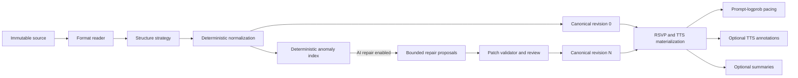

# Local AI Processing Core and Selective Text Recovery Plan

## Status

Proposed on 2026-08-23. This document is the canonical cross-cutting plan for
local language-model execution, selective text repair, AI-assisted structure
discovery, pacing logprobs, and optional reading annotations. It is not yet an
implementation record.

The deterministic extraction details remain owned by:

- `EPUB_CONTENT_HARDENING_PLAN.md`;
- `MALFORMED_EPUB_PROSE_MARKUP_RECOVERY_PLAN.md`;
- `INTERNAL_READING_SECTIONS_PLAN.md`;
- `PDF_LAYOUT_AND_NOTES_PLAN.md`; and
- `PDF_ON_DEVICE_OCR_PLAN.md`.

This plan owns the shared local-AI runtime, policy, scheduling, persistence,
and UI contracts used by those systems.

## Executive Decision

XYZ will use a local language model as an optional processing core, not as a
mandatory ingestion stage.

1. Deterministic extraction, cleaning, chapter construction, and reading must
   work when no model has ever been downloaded.
2. Local-AI text repair is off by default. Enabling adaptive pacing does not
   implicitly enable text repair, summaries, TTS annotation, or AI-assisted
   structure discovery.
3. A fast deterministic scanner may index suspicious spans by default because
   it does not load a model, mutate text, or block reading. Only those bounded
   spans and their local context may be sent to the model.
4. The model proposes patches. It never regenerates or replaces a chapter.
   Every accepted patch is validated, attributed, revisioned, and reversible.
5. Prompt-logprob pacing remains a separate first-class capability. It keeps
   the current input-token surprisal path and does not generate corrected text.
6. One model host owns all WebLLM state. A capability-aware broker serializes
   work, switches models explicitly, handles cancellation, and releases GPU
   resources. Feature code cannot call `getEngine()` directly.
7. Structure discovery becomes a plugin family separate from format readers.
   Deterministic strategies remain the default; an AI strategy is selectable
   and testable in the UI.
8. Raw source stays immutable. Derived text, structure, pacing, and TTS data
   are versioned artifacts that can be rebuilt and garbage-collected.

## Why This Replaces the Old Approach

The early implementation in commit `df9da70` sent every chapter through an
Ollama prompt in roughly 1,000-word chunks. It asked the model to reproduce all
input text with OCR fixes, joined the generated chunks, and stored the result as
the chapter. A concurrency-one queue limited simultaneous calls, but the design
still paid generation cost for the whole book and had no patch provenance,
schema validation, source offsets, resumable results, or protection against
semantic rewriting. On failure it silently substituted the raw chunk.

Commit `37744ca` introduced the better pacing path: run a forward pass over
input tokens, retrieve their log probabilities, and derive surprisal without
generating a rewritten copy. Commit `f06148f` later added one broad `aiEnabled`
switch, initially defaulting to on, to pause density and summary tasks for
battery savings. The current default is off, but the switch still combines
features with different cost and correctness contracts.

The useful lessons are:

- serializing model work was correct but must happen at the engine boundary;
- reading must not depend on model health;
- generating every input token again is the wrong cost model for repair;
- prompt logprobs are the right primitive for pacing; and
- a UI toggle is insufficient unless admission to the runtime is also gated.

## Current-State Findings

The present code provides a strong starting point, but its boundaries need to
be made explicit.

- `src/core/ingest/pipeline.ts` performs deterministic extraction and cleaning,
  then schedules density and summary work in the background.
- `src/core/ingest/scheduler.ts` gates both density and summaries with the same
  `aiEnabled` setting. Its queue is in memory and cannot resume faithfully after
  a reload or crash.
- `src/core/ingest/analysis.ts` already uses a concurrency-one queue and
  incrementally saves density windows.
- `src/core/ai/webllm.ts` owns one mutable engine, but callers can request it
  directly and concurrent callers are not arbitrated around model switches.
- `getPromptLogprobs()` uses `return_input_logprobs`, but currently requests one
  output token as an API compatibility measure and returns randomized fake
  logprobs when the custom response is unavailable. Random values must never be
  presented or persisted as model analysis.
- `src/core/store/settings.ts` has a broad AI switch, multiple role-specific
  model fields, legacy model fields, and ingestion controls whose runtime
  effects are not consistently enforced by the pipeline.
- `src/core/ingest/readers/registry.ts` is already a useful plugin boundary for
  choosing a format reader. It should not also become the structure-strategy
  registry.
- Raw source is retained, which makes non-destructive reprocessing possible.

## Goals

- Repair extraction and OCR artifacts without reading and regenerating the
  complete book.
- Catch cases such as stray `.5` fragments, alphanumeric substitutions,
  mojibake, broken punctuation, split words, malformed markup remnants,
  inconsistent proper names, and suspicious spelling variants.
- Keep false corrections rarer and more visible than missed corrections.
- Share one reliable local model runtime across repair, structure, summaries,
  and future annotations without allowing one feature to destabilize another.
- Keep adaptive pacing responsive while background generation is enabled.
- Make model downloads, storage, memory use, progress, cancellation, failures,
  and cleanup legible to the user.
- Permit structure strategies to be selected and compared without re-importing
  or losing the source file.
- Produce deterministic fixtures, performance baselines, and artifact versions
  so model and detector changes can be evaluated rather than guessed at.

## Non-Goals

- Cloud inference or uploading book text.
- Whole-chapter rewriting, copy editing, grammar normalization, style transfer,
  simplification, or modernization as part of ingestion.
- Treating a language model's confidence statement as proof.
- Automatically correcting dialect, archaic language, quotations, poetry,
  formulas, source code, or proper nouns from dictionary evidence alone.
- Requiring AI to open a book or discover a usable deterministic structure.
- Keeping multiple large WebLLM engines resident for convenience.
- Silently downloading, upgrading, or switching models.

## Source And Artifact Model

The pipeline must distinguish four layers that are currently too easy to mix.

1. **Source**: immutable EPUB/PDF/text bytes and stable source locations.
2. **Canonical text revision**: deterministic extraction plus accepted,
   reversible patches.
3. **Annotations**: non-mutating information such as pronunciation hints,
   sentence roles, boundary evidence, tokens, and surprisal.
4. **Presentation artifacts**: RSVP tokens, densities, summaries, TTS segments,
   and UI projections derived from a specific canonical revision.



Every derived artifact carries the input revision hash. A changed repair or
structure plan invalidates only artifacts that depend on the changed ranges.
No AI result is written into immutable source or used to overwrite the only
copy of extracted text.

## Feature Policy Is Not Runtime State

The app must replace the single semantic meaning of `aiEnabled` with explicit
feature policies. Model readiness is session state and must not be persisted as
a feature preference.

```ts
export interface LocalAIFeatureSettings {
    adaptivePacingEnabled: boolean;
    textRepairMode: 'off' | 'review' | 'auto-safe';
    summariesEnabled: boolean;
    ttsAnnotationsEnabled: boolean;
    structureStrategyId: string;
    repairModelId: string;
}

export type LocalAIRuntimeState =
    | 'idle'
    | 'downloading'
    | 'loading'
    | 'ready'
    | 'executing'
    | 'unloading'
    | 'failed';
```

Fresh-profile defaults:

| Feature | Default | Model load on import | Notes |
| --- | --- | --- | --- |
| Deterministic extraction and cleaning | On | No | Required reading path |
| Deterministic anomaly indexing | On | No | Records candidates only |
| Local-AI text repair | Off | No | Explicit opt-in and warning |
| Adaptive prompt-logprob pacing | Off | No | Preserve current fresh-profile behavior |
| Automatic summaries | Off | No | Independent of pacing and repair |
| AI TTS annotations | Off | No | Separate from TTS playback |
| Structure strategy | `auto-deterministic` | No | AI strategy is explicit and experimental |

Migration must preserve an existing user's `aiEnabled` value as their adaptive
pacing preference only. It must not turn on repair, summaries, TTS annotation,
or AI structure. Existing `summariesEnabled` remains authoritative. Legacy
model settings should be migrated once and then removed from feature code.

Turning repair on applies to future imports by default. The UI separately
offers **Scan current book** and **Scan library** actions, with a candidate and
time estimate before work starts. This avoids surprising reprocessing of every
stored book after a settings change.

## Model Capabilities And Initial Roles

Model selection must be capability-based rather than tier-based. A manifest
describes what a compiled model and runtime combination can actually do.

```ts
export type ModelCapability =
    | 'input-logprobs'
    | 'structured-generation'
    | 'plain-generation';

export interface LocalModelManifest {
    id: string;
    displayName: string;
    artifactVersion: string;
    capabilities: ModelCapability[];
    downloadBytes: number;
    estimatedVramBytes: number;
    contextTokens: number;
    modelUrl: string;
    modelLibraryUrl: string;
}
```

Initial role decision:

- Keep the custom TinyLlama 1.1B logprob build as the pacing default until a
  replacement passes the pacing benchmark. Its known input-logprob support is
  more important than a speculative model upgrade.
- Use Qwen2.5 1.5B Instruct as the initial repair and AI-structure model because
  these tasks need constrained generation and it is already represented in the
  app config. It must pass the repair corpus before `auto-safe` is exposed.
- Do not force one model to serve both roles. An instruction-tuned generation
  model is not automatically the best psycholinguistic probability model, and
  a small pacing model is not automatically a safe proofreader.
- Do not implement hidden auto-upgrade. Model changes are explicit and include
  their download size, expected memory, and affected features.

Candidate base models may later replace the pacing model, but only after they
support the custom input-logprob path and improve held-out reading-time or
artifact-discrimination metrics without unacceptable device cost.

## Why Prompt Logprobs Stay

The pacing intuition is sound. For token $x_i$ in context $x_{<i}$, pacing uses

$$
S(x_i) = -\log P(x_i \mid x_{<i}).
$$

The model evaluates the actual input sequence during prefill. It does not need
to autoregressively reproduce that sequence as output. Prefill still costs work
proportional to the input and context length, but it avoids a sequential decode
step for every word. That is materially cheaper and is a better signal than
asking a chat model to label a passage as simple or difficult.

The target API is a pure prefill/logprob operation with zero decoded output
tokens. If the current WebLLM fork requires `max_tokens: 1`, keep that only as a
measured compatibility shim while adding a direct prefill endpoint. Do not
replace prompt logprobs with generated annotations.

Pacing correctness requirements:

- Missing input logprobs produce an explicit unavailable state, not randomized
  fake values. The deterministic fallback is neutral density or the existing
  non-AI duration strategy, clearly labeled.
- Token-to-word alignment uses tokenizer byte/character offsets rather than
  accumulated display-string length.
- Stored analysis includes model fingerprint, tokenizer fingerprint, windowing
  version, normalization version, and canonical text hash.
- Percentile normalization remains useful for model-scale differences, but its
  window-local behavior must be benchmarked against book/chapter-level
  calibration.
- Repairs run before new pacing analysis. Accepting a later repair invalidates
  only overlapping density windows.
- Surprisal outliers may become an additional anomaly signal when pacing has
  already run. High surprisal alone never proves corruption, especially for
  names, technical language, and stylistic novelty.

## Deterministic Anomaly Index

The scanner runs after format-specific extraction and deterministic cleanup but
before lossy RSVP tokenization. It works over structured spans with stable
source locations and preserves an offset map through every normalization step.
It should run in a worker when a book is large.

Each detector emits evidence rather than a replacement:

```ts
export interface TextIssueCandidate {
    id: string;
    bookId: string;
    sourceUnitId: string;
    revisionHash: string;
    startOffset: number;
    endOffset: number;
    originalHash: string;
    detectorIds: string[];
    evidence: Record<string, string | number | boolean>;
    severity: 'low' | 'medium' | 'high';
    ambiguity: 'low' | 'medium' | 'high';
}
```

Initial detector families:

| Family | Examples | Important exclusions |
| --- | --- | --- |
| Encoding | replacement characters, mojibake, control characters, broken ligatures | intentional non-Latin text |
| Markup residue | visible attributes, tag fragments, entity remnants | quoted code and XML examples |
| Numeric intrusion | `th3`, `B0ok`, lone `.5`, letters inside digit runs | decimals, dates, section numbers, formulas |
| Punctuation | orphan punctuation, impossible spacing, repeated marks | ellipses, dialogue styles, poetry |
| Word boundaries | OCR splits, line-end hyphen joins, fused words | authored compounds and lineated verse |
| Repeated headers | page numbers, running titles, scan labels | chapter numbers and intentional lists |
| Lexical consistency | rare spelling, conflicting proper-name forms | dialect, archaism, multilingual text |
| Speech hints | abbreviations, names, symbols, mixed-language spans | ordinary words the TTS engine handles |

A detector must not simply delete `.5`. It should inspect whether the fragment
is line-isolated, adjacent to prose, part of a valid decimal, repeated like a
page sequence, traceable to a source element, or surrounded by other extraction
damage. Ambiguous numeric fragments are candidates for review, not automatic
removal.

Proper names and spelling require book-level evidence. The scanner can compare
case-folded forms, edit distance, frequency, nearby titles, metadata, and the
dominant spelling elsewhere in the book. A dictionary miss alone remains
low-confidence evidence and cannot authorize an automatic patch.

Candidate post-processing must:

- merge overlapping detector hits;
- group nearby candidates into sentence-sized windows;
- deduplicate repeated running-header patterns;
- cap context without cutting grapheme clusters or source blocks;
- retain exact candidate spans within the bounded context; and
- trip a circuit breaker when a detector flags too much text.

If more than 5% of a source unit or more than 1,000 candidates in a book are
flagged, stop AI admission and report a likely extraction-level failure. The
correct response is to improve the reader or normalization rule, not to feed
the whole malformed book into generation.

## Selective Repair Protocol

The repair model receives candidate IDs, exact suspicious strings, bounded
sentence context, detector evidence, language hints when reliable, and repeated
forms relevant to that candidate. It does not receive an instruction to return
the passage.

The response is grammar-constrained JSON:

```ts
export interface RepairProposal {
    candidateId: string;
    action: 'keep' | 'replace' | 'delete' | 'merge' | 'split';
    replacement?: string;
    reasonCode:
        | 'encoding-artifact'
        | 'ocr-substitution'
        | 'stray-page-marker'
        | 'broken-boundary'
        | 'punctuation-artifact'
        | 'consistent-book-form'
        | 'uncertain';
}
```

Model-reported confidence is intentionally absent from the authorization
contract. The deterministic validator decides whether a proposal is usable.

Validation rejects a proposal when:

- the candidate ID or source revision is unknown or stale;
- it changes text outside the candidate span;
- output is not valid schema-constrained JSON;
- replacement size exceeds a detector-specific bound;
- it introduces control characters, markup residue, or new high-severity
  candidates;
- it conflicts with another accepted patch;
- it changes protected content such as a URL, identifier, formula, code span,
  note anchor, or image marker;
- it changes too many lexical characters for the claimed repair class; or
- it removes content without extraction evidence that the content is an
  artifact.

Batch limits start conservatively: at most eight candidates and about 1,500
input tokens per request, with output capped to the structured patch payload.
Adjacent candidates may share one context window. The broker checkpoints after
every batch and yields between batches.

### Application Policy

`review` is the first shippable mode and the mode selected when a user initially
enables repair. `auto-safe` remains unavailable until the repair corpus and
reversibility UI pass acceptance.

Even in `auto-safe`, only low-ambiguity local edits may be applied without
review, for example a replacement character resolved by source evidence or an
isolated scan page marker confirmed by a repeated sequence. Proper nouns,
ordinary misspellings, punctuation that could be authorial, and edits spanning
multiple words always require review.

The review UI shows source context, proposed context, detector evidence, model
and prompt version, and **Accept**, **Keep original**, and **Accept all safe**
commands. It never uses a single opaque "AI cleaned" status.

## Content Revisions And Reading Stability

AI work must not mutate the token array under an active reader cursor.

- Deterministic revision 0 becomes readable immediately.
- Repair proposals can be prepared in the background.
- Applying proposals creates a new immutable canonical revision.
- A new revision is activated only on an explicit review commit or at a safe
  chapter transition.
- Reading position, notes, and highlights are remapped using stable source
  anchors. Word indexes are projections and are not sufficient identity.
- If an anchor cannot be mapped unambiguously, keep the current revision active
  and ask the user to review the conflict.

This allows a user to read while optional processing continues without words
appearing, disappearing, or shifting underneath playback.

Suggested persisted records:

```ts
export interface ContentRevisionRecord {
    id: string;
    bookId: string;
    sourceUnitId: string;
    parentRevisionId?: string;
    sourceHash: string;
    textHash: string;
    pipelineVersion: string;
    acceptedPatchIds: string[];
    createdAt: number;
    state: 'prepared' | 'active' | 'superseded';
}
```

  Repair annotations remain available after a proposal is accepted so later
  renderers do not need to reread prompts or infer changes from a text diff:

  ```ts
  export interface RepairAnnotation {
    id: string;
    bookId: string;
    sourceUnitId: string;
    sourceRevisionId: string;
    canonicalRevisionId: string;
    sourceAnchor: {
      startOffset: number;
      endOffset: number;
      startTokenId?: string;
      endTokenId?: string;
      contextHash: string;
    };
    canonicalAnchor: {
      startOffset: number;
      endOffset: number;
      startTokenId?: string;
      endTokenId?: string;
      anchorHash: string;
    };
    originalText?: string;
    replacementText?: string;
    action: 'keep' | 'replace' | 'delete' | 'merge' | 'split';
    detectorIds: string[];
    detectorEvidence: Record<string, string | number | boolean>;
    modelFingerprint?: string;
    promptFingerprint?: string;
    validatorFingerprint: string;
    pipelineFingerprint: string;
    proposalState: 'proposed' | 'accepted' | 'kept-original' | 'rejected' | 'superseded';
    acceptedAt?: number;
    acceptanceAction?: 'accept' | 'keep-original' | 'accept-all-safe';
    renderRange: {
      kind: 'text-range';
      startOffset: number;
      endOffset: number;
      anchorHash: string;
    };
  }
  ```

  `sourceAnchor` identifies the evidence in retained source, while
  `canonicalAnchor` and `renderRange` identify the location in the active text
  revision. The rendering-neutral range is the shared input for highlights,
  margin notes, search results, audit views, and TTS or pacing overlays. It must
  be queryable by source unit, revision, chapter, and range, and must not live
  only in transient review UI state. Issue records store offsets, hashes,
  evidence, state, and compact proposals; they do not duplicate full prompt
  context. Context is reconstructed ephemerally from the retained source and
  revision.

## Model Host And Compute Broker

### Ownership

Create a single `LocalModelHost` in a dedicated Web Worker. It is the only code
allowed to import the WebLLM runtime, create an engine, reload it, or unload it.
`src/core/ai/service.ts` becomes a typed client to the broker rather than a thin
wrapper around global engine functions.

Use a Web Worker, not a service worker, for initial ownership. A service worker
has a browser-controlled lifetime and may be terminated between requests; that
is a poor place for the only in-memory model owner. Persistent model artifacts
remain in WebLLM's supported browser cache.

The host maintains:

- one engine reference;
- one current model fingerprint;
- one in-flight load promise, shared by duplicate requests;
- one serialized command loop;
- one device-lost listener;
- one idle-unload timer; and
- no retained prompts after a request settles.

### Request Contract

```ts
export interface LocalAIRequest<T> {
    id: string;
    feature: 'pacing' | 'repair' | 'structure' | 'summary' | 'tts-annotation';
    capability: ModelCapability;
    modelId: string;
    priority: number;
    deadlineAt?: number;
    inputHash: string;
    signal: AbortSignal;
    run: (engine: LocalModelEngine) => Promise<T>;
}
```

The real worker message uses serializable payloads rather than a function, but
the contract above captures the ownership rule.

The broker:

1. rejects a request when its feature policy is off;
2. returns a valid cached artifact before loading a model;
3. coalesces duplicate requests by artifact key;
4. chooses a model with the required capability;
5. waits for or cancels lower-priority work at a checkpoint;
6. drains the active command before switching models;
7. awaits unload, clears all references, then loads the next model;
8. publishes structured progress and resource state; and
9. settles every queued promise on abort, unload, crash, or disposal.

Direct calls to `getEngine()`, `generateWebLLMCompletion()`, and model cache
deletion outside this layer should become impossible through module exports and
an architecture test.

### Scheduling Policy

All WebLLM inference has concurrency one. Priority also considers deadlines and
starvation:

1. a user-blocking structure or single-repair request;
2. near-cursor pacing with a reading deadline;
3. pacing lookahead;
4. user-started repair batches;
5. optional TTS annotation;
6. summaries and library-wide background work.

The broker should keep the pacing model sticky during active RSVP reading.
Generation batches yield at least at every batch or chapter boundary. A queued
background feature cannot repeatedly switch the engine away from pacing. When
the user explicitly starts a repair batch during reading, the UI states that
adaptive pacing will temporarily use already-computed values.

A broader `LocalComputeCoordinator` grants GPU-heavy leases to WebLLM and TTS.
On conservative or low-memory profiles, active TTS playback blocks background
LLM generation. Interactive playback and reading never wait behind summaries.
The coordinator does not pretend the browser exposes exact free VRAM; it uses
adapter limits, `deviceMemory` when available, model manifests, recent crashes,
and a one-heavy-engine policy.

### Unload And Crash Rules

- Abort at model-supported checkpoints; never call unload while an engine call
  is still mutating runtime state.
- Unload immediately when the active cached model is deleted, a GPU lease is
  revoked, the device is lost, or repeated out-of-memory failures trip the
  circuit breaker.
- Otherwise unload after a measured idle interval, initially 60 seconds, when
  no compatible work is queued. Keep weights cached on disk unless the user
  explicitly evicts them.
- Clear timers, callbacks, progress subscriptions, worker message listeners,
  engine references, and retained request payloads on disposal.
- Retry one load after a clean unload for recoverable device loss. Do not enter
  an automatic crash/reload loop.
- Keep failures feature-scoped. A failed summary must not mark cached pacing
  analysis or deterministic reading as failed.

## Persistent Work And Artifact Cache

The current scheduler is in memory. Replace model-dependent background work
with a small persistent job collection.

```ts
export interface ProcessingJobRecord {
    id: string;
    dedupeKey: string;
    feature: LocalAIRequest<unknown>['feature'];
    bookId: string;
    sourceUnitId?: string;
    inputRevisionHash: string;
    modelFingerprint: string;
    pipelineVersion: string;
    state: 'pending' | 'running' | 'blocked' | 'completed' | 'failed' | 'cancelled' | 'stale';
    attemptCount: number;
    checkpoint?: string;
    createdAt: number;
    updatedAt: number;
}
```

On startup, interrupted `running` jobs return to `pending` only when their
feature is still enabled and their input revision still exists. Jobs have a
dedupe key and bounded retry count. Turning a feature off blocks admission,
aborts active work at a checkpoint, and marks queued work blocked rather than
quietly running it later.

Derived artifact keys include:

`feature + input hash + range + model fingerprint + prompt/detector/pipeline version`

Storage rules:

- WebLLM weights live only in the runtime's model cache, not RxDB and not the
  PWA precache.
- Raw books remain the source of truth; AI records do not store another full
  copy of the book.
- Prompt transcripts and full context windows are ephemeral by default.
- Deleting a book cascades jobs, issues, revisions, and derived artifacts.
- Superseded artifacts are removed by bounded idle garbage collection.
- Model eviction unloads the active model first and deletes all cache entries
  belonging to the manifest fingerprint.
- Settings shows cached bytes, loaded model, estimated resident memory, and
  per-feature derived-data totals separately.
- Before a large download, estimate quota and handle storage rejection without
  changing feature settings to a falsely ready state.

Any new RxDB schema requires a version increment, the migration plugin, and a
strategy for every prior version. Tests must reopen a database persisted with
the previous schema; fresh-database tests are insufficient.

## Structure Discovery Plugins

Format readers and structure strategies answer different questions:

- an `IngestReaderPlugin` decides how to open EPUB, PDF, Markdown, or plain text
  and expose source units; and
- a `StructureDiscoveryPlugin` decides which evidenced boundaries form reading
  sections for those units.

Do not add AI branches directly to `EpubIngestReader` or
`buildEpubStructurePlan()`. Add a second dependency-injected registry.

```ts
export interface StructureDiscoveryPlugin {
    id: string;
    displayName: string;
    version: string;
    kind: 'deterministic' | 'ai-assisted';
    supports(input: StructureSourceDocument): boolean;
    discover(
        input: StructureSourceDocument,
        options: { signal: AbortSignal },
    ): Promise<StructureProposal>;
}

export interface StructureProposal {
    pluginId: string;
    pluginVersion: string;
    boundaries: Array<{
        sourceAnchorId: string;
        titleSourceAnchorId?: string;
        evidence: string[];
        confidence: number;
    }>;
    issues: string[];
}
```

Initial strategies:

- `auto-deterministic`: current publisher navigation, document headings, scan
  headings, and spine/layout fallback policy;
- `publisher-navigation`: use authored EPUB nav/NCX or PDF outline only;
- `document-headings`: use evidenced heading elements/layout roles;
- `source-units`: expose EPUB spine items, PDF pages/groups, or text blocks;
- `ai-assisted-candidates`: choose among already extracted boundary candidates;
  and
- fixture/debug strategies registered only in development and tests.

The AI strategy receives IDs and compact metadata for candidate headings,
publisher entries, page labels, source-unit lengths, and local heading context.
It may select or group candidate anchors. It may not invent an unanchored
boundary or silently discard prose.

Every proposal is rejected unless boundaries are monotonic, anchored, free of
overlap, cover all retained content exactly once, preserve notes/images, and
stay within section-size safety limits. Titles retain authored evidence or are
explicitly labeled generated.

The import UI offers a structure selector with deterministic auto as the
default. A diagnostic comparison view shows section count, title evidence,
coverage, merges/splits, and validation issues for each compatible strategy.
Changing strategy reuses the raw source, creates a new structure revision, and
does not silently replace the structure of a book currently being read.

Persist plugin ID, version, boundary evidence, source anchors, and structure
revision. This extends the existing `structureSource`, `boundaryEvidence`,
`structureMode`, and `structureVersion` concepts instead of creating unrelated
metadata.

## TTS And Pacing Annotations

Text repair, TTS annotation, and pacing annotation can share candidate scanning
and source anchors, but they produce different artifact types.

- Text repair may create a new canonical revision.
- TTS annotation is an overlay: pronunciation, language, abbreviation
  expansion, pause hints, or sentence boundary information. It never changes
  displayed text.
- Pacing annotation stores tokenizer/logprob evidence and derived duration
  factors. It never changes canonical text.

TTS model output must use a strict schema supported by the selected voice
engine. Do not generate IPA or phoneme strings that the engine cannot consume.
Names, symbols, and mixed-language spans are good candidates; annotating every
word is not.

The continuous TTS controller described in
`CONTINUOUS_TTS_PACING_AND_WPM_PLAN.md` remains responsible for delivered audio
timing. AI hints may inform sentence budgets and pronunciation, but they do not
override queue safety, measured duration, or the user's speed setting.

For pacing, deterministic punctuation, word length, phrase grouping, and
sentence-boundary features remain available when logprobs are absent. Model
annotations augment those signals; they do not make playback depend on model
availability.

## UI And User Communication

### Settings Information Architecture

Replace the impression of one global AI switch with a **Local AI** settings
area containing feature cards:

- Adaptive pacing;
- Text repair;
- Summaries;
- TTS annotations;
- Structure strategy; and
- Models and storage.

The reader toolbar's quick AI control continues to control adaptive pacing
only. Its label and tooltip must say pacing, not AI. A shortcut must never
enable repair or summaries.

The text-repair card contains:

- Off / Review proposals / Auto-apply safe repairs;
- model choice and download size;
- new imports / current book / library scope;
- candidate count and last scan version;
- pending review count;
- pause/cancel action; and
- link to the issue review surface.

Initial enablement requires affirmative confirmation with copy equivalent to:

> Local AI text repair is off by default. When enabled, XYZ downloads an
> on-device model of about 1 GB. Processing can make imports substantially
> slower, increase battery use, and temporarily compete with adaptive pacing or
> text-to-speech. Only flagged passages are processed, book text stays on this
> device, and the original text is retained.

The confirmation shows the actual selected model size, not only the generic
estimate. A cached model still shows expected memory and performance impact.

### Import And Reader Feedback

Import remains immediately useful:

1. Extracting source;
2. Building deterministic structure;
3. Preparing readable text;
4. Indexed 17 suspicious fragments; and
5. Repairing flagged fragments 4/17, when opted in.

AI repair progress is not called ingestion progress after deterministic text is
ready. Users can open the book, pause repair, or review proposals. The reader
shows a quiet issue count rather than repeated crash alerts. Feature errors are
inline and actionable: retry, use original, unload model, free storage, or
disable that feature.

The model manager distinguishes:

- **Downloaded**: weights persist in browser storage;
- **Loaded**: currently occupies runtime/GPU memory;
- **Working**: executing a named feature request; and
- **Derived data**: repair/pacing/summary artifacts stored for books.

Delete and unload are separate commands with their consequences stated before
execution.

## Performance Budgets And Backpressure

The scanner should make the generation cost proportional to suspicious cases,
not book length. Track these local aggregate metrics without storing text:

- characters and source units scanned;
- candidates by detector;
- candidate rate;
- input and output tokens by feature;
- model load/switch/unload duration;
- queue wait and inference duration;
- cache hits;
- accepted, kept, rejected, and invalid proposals;
- device-loss and out-of-memory counts; and
- active and peak derived-data bytes.

Initial benchmark gates:

- deterministic scanning does not load WebLLM or fetch model assets;
- scanning 100,000 characters stays below 100 ms on the reference desktop and
  below 500 ms on the reference mobile profile, measured outside test mode;
- importing with repair off stays within 5% of deterministic baseline time;
- repair sends less than 10% of book tokens on the malformed-text corpus;
- cancel is observed by the next candidate batch or logprob window;
- only one WebLLM engine exists and only one inference call is active;
- active reading does not wait behind summary or library-wide repair work; and
- repeated enable/disable/model-switch cycles return memory near the measured
  post-unload baseline, allowing for browser-managed cache variance.

These are starting budgets and must be recorded in a benchmark document rather
than weakened when they fail. A corpus with no anomalies, sparse `.5`/OCR
artifacts, dense corruption, multilingual prose, poetry, formulas, and proper
nouns is required.

## Failure Semantics

- Deterministic extraction failure is an import error with source diagnostics.
- Anomaly scanner failure leaves deterministic text readable and records no
  false clean state.
- Invalid model output is retried once with the same bounded input and stricter
  schema instruction, then becomes a reviewable failed proposal.
- Repair failure never substitutes generated or partial text.
- Pacing failure switches to a deterministic duration strategy or neutral
  densities and clearly marks model analysis unavailable.
- Structure proposal failure falls back to the selected deterministic strategy.
- A quota error does not delete source or unrelated model caches.
- A model crash rejects the active request, unloads cleanly, preserves queued
  jobs, and requires an explicit or single bounded recovery attempt.
- Turning a feature off prevents new requests at both scheduler and broker
  boundaries.

## Security And Privacy

- No source text, candidate context, prompts, or model output leaves the device.
- Model and WASM URLs are allow-listed by the manifest and governed by the
  existing content security policy.
- Rendering never treats model output as HTML.
- Repair strings are applied as text through validated spans.
- Imported adversarial text cannot change system instructions, request tools,
  choose models, or escape the output schema.
- Diagnostic export excludes book text and prompt payloads by default.
- A future remote provider must implement a separate policy and consent design;
  it cannot be added behind the local-provider interface without explicit UI.

## Implementation Phases

### Phase 0: Split Policy And Remove False Signals

- Replace broad feature use of `aiEnabled` with separate pacing and summary
  policies; add repair/TTS/structure settings defaulted off or deterministic.
- Migrate persisted settings without enabling any new feature.
- Remove randomized logprob fallback and expose an unavailable result.
- Audit every settings control against an actual runtime policy; remove or wire
  legacy controls rather than leaving decorative switches.
- Add tests proving a fresh import makes no model request or model-asset fetch.

### Phase 1: Model Host And Broker

- Move WebLLM ownership into one worker-backed host.
- Add capability manifests, request deduplication, cancellation, progress,
  model-switch serialization, cache inventory, and unload rules.
- Route pacing and summaries through the broker before adding another feature.
- Add TTS/WebLLM compute coordination and repeated lifecycle stress tests.

### Phase 2: Detector-Only Text Quality Report

- Add structured source spans and normalization offset maps.
- Implement high-precision encoding, markup, numeric, punctuation, boundary,
  and repeated-header detectors.
- Persist compact issue records and build the review/report UI with no LLM.
- Add `.5`, valid decimal, proper noun, poetry, formula, and multilingual
  fixtures.

### Phase 3: Review-Only Selective Repair

- Add Qwen structured repair requests for bounded candidates.
- Validate proposals, persist provenance, and create content revisions.
- Implement accept/keep/bulk-safe review and source-anchor cursor remapping.
- Keep live chapters pinned to their active revision.

### Phase 4: Safe Automation And Persistent Jobs

- Add persistent resumable jobs, artifact caching, stale invalidation, and
  garbage collection.
- Enable `auto-safe` only for detector classes that pass corpus precision and
  reversibility gates.
- Add library-wide estimates, pause/cancel, battery-aware backpressure, and
  circuit breakers.

### Phase 5: Structure Strategy Registry

- Extract current structure planning behind `StructureDiscoveryPlugin`.
- Add deterministic strategies, proposal validation, comparison diagnostics,
  and source-backed reprocessing.
- Add AI candidate selection only after deterministic strategies are selectable
  and measured in the same UI.

### Phase 6: Selective TTS And Pacing Annotations

- Add source-anchored speech candidates and engine-compatible pronunciation
  overlays.
- Feed already-computed surprisal outliers into anomaly evidence without making
  repair depend on pacing.
- Version annotation artifacts and invalidate only affected ranges.
- Benchmark contention with continuous TTS and active RSVP reading.

## Test Strategy

### Unit

- Every detector has positive, negative, Unicode, language, and boundary cases.
- `.5` is flagged in prose-artifact fixtures and retained in decimal, version,
  measurement, and list fixtures.
- Candidate grouping preserves source offsets and grapheme boundaries.
- Patch validation rejects stale, overlapping, oversized, out-of-span, markup,
  and protected-content edits.
- Model capability resolution cannot select a generation-only model for pacing.
- Feature-off policy rejects requests before WebLLM is imported.
- Job and artifact keys change for every relevant version or input change.

### Integration

- Import with every AI feature off produces readable deterministic chapters and
  no model request.
- Repair failure and cancellation preserve revision 0 byte-for-byte.
- Accepted repairs rebuild only dependent RSVP, pacing, and TTS ranges.
- Accepted and retained repair annotations are retrievable by source unit,
  revision, chapter, and range and render without model or prompt access.
- Existing reading state and notes map across an accepted local patch.
- Pacing preempts/yields background work without concurrent engine use.
- Model switches await active work and release old engine references.
- Book deletion cascades all jobs and derived artifacts but leaves shared model
  weights until explicitly evicted.
- Persisted old settings and database schemas reopen through migrations.
- Structure strategies preserve complete, non-duplicated source coverage.

### End-To-End

- Fresh user imports and reads without a WebGPU prompt or AI download.
- Enabling repair shows the performance warning and actual model size.
- Scan, proposal review, cancellation, retry, unload, and cache deletion are
  usable on desktop and mobile layouts.
- The reader quick control changes pacing only.
- AI structure can be compared with deterministic structure and reverted.
- Browser reload during repair resumes from a checkpoint without duplicate
  patches.
- Device loss, quota exhaustion, invalid output, and unsupported WebGPU produce
  one actionable feature error and leave reading available.

## Acceptance Criteria

The architecture is complete when all of the following are true:

1. No local model is downloaded, loaded, or called by importing a book with
   default settings.
2. Enabling one AI feature cannot enable another feature as a side effect.
3. No repair request contains an unflagged whole chapter, and no model response
   can replace a whole chapter.
4. Original source and deterministic revision remain recoverable after every
   accepted repair.
5. Every applied patch identifies detector, source span, source revision,
   model, prompt version, validator version, and acceptance action.
6. Prompt-logprob pacing uses real input logprobs or an explicit deterministic
   fallback; randomized synthetic logprobs do not exist.
7. One broker owns all WebLLM lifecycle transitions and tests prove there is at
   most one live engine and one active inference.
8. Cancelling, disabling, deleting, switching, and crashing settle all work and
   do not leave stale loaded-state UI or retained request payloads.
9. Structure plugins are selectable against the same source and all accepted
   plans preserve complete source coverage.
10. Repair, pacing, TTS, and structure artifacts are revisioned, independently
    invalidated, and removed with their book.
11. The performance budgets are measured on the agreed device profiles and the
    results are checked into the repository.
12. The UI states cost, privacy, storage, model status, active feature, progress,
    and reversibility before and during model work.

## Resolved Decisions

- Selective candidate repair replaces whole-text regeneration.
- Text repair is off by default; deterministic candidate indexing may remain on.
- Review-only ships before automatic application.
- Pacing keeps input-token logprobs and its dedicated model role.
- The current TinyLlama logprob model remains the initial pacing default.
- Qwen2.5 1.5B is the initial repair/structure candidate, pending corpus gates.
- Model execution is serialized through one worker-owned host.
- AI structure chooses source-backed candidates and is not the default.
- Raw source, canonical revisions, annotations, and presentation artifacts are
  distinct persisted concepts.
- One canonical plan is preferable to separate overlapping AI plans; fixture
  and benchmark documents may be added as evidence appendices.

## Open Measurements, Not Open Architecture

Implementation should measure rather than debate these values indefinitely:

- detector thresholds and circuit-breaker rates;
- candidate context and batch sizes;
- idle unload interval;
- Qwen repair precision by detector and language;
- TinyLlama versus candidate base-model pacing correlation;
- per-device contention policy for WebLLM and TTS; and
- artifact retention limits.

Changing those values does not require reopening the core decisions above.