# Pre-rendered Audiobooks: Product and Implementation Plan

## Status

- Future feature proposal as of 2026-08-23. No `src/core/audio-render/` runtime,
  rendered-audio artifact schema, OPFS audio repository, or rendered playback
  controller exists yet.
- The current application has live sentence synthesis through Web Audio and a
  Media Session integration for that live path. It does not yet play stored
  audio or provide a `rendered-only` policy.
- Keep this document as the product and architecture handoff. Its phases are
  prerequisites, not evidence that the feature is already underway.

## Document purpose

This is the execution plan for XYZ. It covers rendering selected chapters or a
whole book ahead of time, playing the stored result without running TTS, keeping
long jobs understandable and cancellable, exporting portable audio, and moving
rendered tracks through the existing QR/WebRTC exchange.

The feature is complete only when a user can render a book overnight, return
later, press Play, and verify that playback does not initialize Kokoro or Piper.
That is the primary product contract, not an implementation detail.

## Product outcome

A user must be able to:

1. Start from a book card and choose one chapter, several chapters, unread
   chapters, or the entire book.
2. See the selected voice, base narration speed, estimated audio duration,
   estimated storage, and a realistic warning about keeping the app open before
   committing.
3. Leave the setup sheet while a persistent activity indicator continues to
   show overall and current-chapter progress.
4. Pause, resume, or cancel a job. Cancelling must take effect after the current
   sentence at the latest under normal operation. A force-stop path must be
   available if an engine call does not return.
5. Keep already completed chapters when a larger job is paused, cancelled,
   interrupted, or runs out of storage.
6. Play a matching rendered chapter using the browser's native media pipeline,
   with no TTS model initialization or inference.
7. Choose a `Rendered only` playback policy that can never silently fall back
   to live synthesis.
8. Transfer selected rendered tracks with the existing QR exchange and see the
   additional size before either device starts the bulk transfer.
9. Export chapter audio as ordinary files and export a rendered book without
   assembling the whole book in memory.

## Firm architecture decisions

### 1. A rendered book is a collection of immutable chapter tracks

Do not build one giant in-memory waveform or one monolithic whole-book Blob.
Each readable chapter is an independent compressed track with a timing sidecar.
The application presents those tracks as one audiobook and advances between
them automatically.

Chapter granularity gives the product useful selection, progress, cancellation,
resume, replacement, transfer, deletion, and failure boundaries. A failed or
cancelled chapter must not invalidate tracks that were already committed.

### 2. Binary audio lives in OPFS; metadata lives in RxDB

Do not put audio into RxDB JSON, do not Base64-encode it, and do not put it in
the current exchange bundle. Base64 adds about 33% and the existing bundle path
serializes and reassembles the complete payload in memory.

Use OPFS for immutable track and timing files. Add small RxDB collections for
artifact lookup and persisted job state. RxDB metadata is the commit marker: an
OPFS file is not playable or transferable until its complete metadata document
exists and its checksum has been verified.

Adding new version-0 collections to `xyz_db_v17` does not require renaming the
database. Do not bump the database name and strand the existing library. Future
changes to an existing collection schema must increment that collection's
schema version and provide every migration strategy.

### 3. Rendering and live playback share synthesis primitives, not queues

Reuse sentence splitting, voice resolution, engine initialization, validation,
silence trimming, and speech generation from `src/core/tts`. Do not route an
offline job through `TTSAudioPlayer`, its lookahead buffer, or React state.

Rendering is a durable job with its own coordinator. Live playback is a
latency-sensitive stream. They may use the same low-level synthesis runtime,
but they have different scheduling, persistence, and cancellation contracts.

### 4. Stored playback is a separate media path

Do not decode an entire chapter into an `AudioBuffer`. Use an
`HTMLAudioElement` backed by the OPFS `File`/object URL so the browser can decode
incrementally, expose lock-screen controls, and continue mobile media playback
more reliably than the current Web Audio sentence queue.

`TTSPlayer` becomes the source coordinator:

- rendered source: `RenderedAudioController` plus native media element;
- live source: the existing sentence generator plus `TTSAudioPlayer`.

The rendered path must not call `initTTS`, `streamSpeech`, or `generateSpeech`.

### 5. Render one job at a time

Global render concurrency is one. Both engines already serialize inference;
parallel chapter generation would duplicate model memory, increase heat, and
usually reduce useful throughput. Reuse one loaded voice session across adjacent
chapters and group queued work by render profile where this does not violate
user order.

### 6. Use compressed, streamable speech audio

The preferred v1 portable format is mono MP3 at 64 kbit/s, one file per chapter.
It is broadly playable on phones and desktop players and costs about 28.8 MB per
audio hour. By comparison, 24 kHz mono 16-bit PCM costs about 172.8 MB per hour.

Do not ship whole-book WAV as the production path. Phase 0 must select and pin a
maintained browser-compatible streaming encoder after measuring it. If a
streaming MP3 encoder cannot meet the acceptance gate, use Opus in WebM through
WebCodecs plus a maintained muxer, and document the reduced generic-player
portability before continuing. The container and codec remain explicit in
artifact metadata so this choice can evolve.

## Current code anchors

The implementation must work with these existing owners:

| Concern | Current owner | Required change |
| --- | --- | --- |
| Sentence synthesis | `src/core/tts/engine.ts` `streamSpeech()` | Add abort-aware low-level execution without changing live output |
| Kokoro speed | `src/core/tts/kokoro.ts` | Preserve that requested speed is baked into samples |
| Piper speed | `src/core/tts/piper.ts` | Preserve that samples are natural speed and `playbackRate` carries speed |
| Live playback | `src/core/tts/player.ts`, `src/components/Reader/TTSPlayer.tsx` | Keep as live fallback; add source coordination rather than cache checks inside queue code |
| Listening position | `src/core/store/tts.ts`, `src/core/exchange/handoff.ts` | Let rendered playback publish the same audible position contract |
| Library actions | `src/components/Library/Archive.tsx`, `BookCard.tsx` | Add render entry point, state, deletion cascade, and artifact summary |
| App-level activity | `src/App.tsx` | Mount the render coordinator and persistent activity dock above routes |
| Database | `src/core/sync/db.ts`, `schema.ts` | Add metadata/job collections, types, indexes, and persisted reopen tests |
| QR exchange | `src/core/exchange/*`, `src/components/Exchange/*` | Add negotiated v2 attachments streamed directly to staging OPFS |
| Existing transfer | `src/core/exchange/pairing.ts` | Reuse chunking/backpressure/checksums, replace whole-payload accumulation for binary assets |

The ingestion scheduler is in-memory and specialized for density and summary
lookahead. Do not add audio tasks to it. Rendering needs persisted queue state,
storage accounting, chapter artifacts, and a different priority model.

## User experience

### Entry points

#### Archive book card

Add a Headphones action with tooltip and accessible label:

- no tracks: `Render audio`;
- partial tracks: `Audio: 4 of 18 chapters`;
- complete matching profile: `Audio ready`;
- active job: `Rendering audio: 37%`.

The action opens the shared render sheet. Do not make card clicks themselves
start expensive work.

#### Reader audio controls

Add `Render this chapter` and `Manage rendered audio` to the existing audio
surface. Show a compact source label whenever the controls are expanded:

- `Rendered on this device`;
- `Live synthesis - uses the TTS model`;
- `Rendered at 1.0x, playing at 1.25x` when relative speed is applied;
- `Rendered audio unavailable for this voice` when a different profile exists.

#### Persistent activity dock

Mount `RenderActivityDock` in `App.tsx`, including in Reader. It remains visible
after the render sheet closes and opens the full manager when selected. It must
not cover `TTSPlayer`, `AIStatusPanel`, mobile navigation, or update prompts.

Collapsed example:

```text
Rendering audio  43%
Chapter 7 of 19  38 min left
[Pause] [Open]
```

The full manager shows queued books, current and total chapter progress,
generated audio duration, stored size, elapsed time, ETA, failures, and actions.
Progress bars use `role="progressbar"`; status announcements are throttled so a
screen reader is not notified for every sentence.

### Render setup sheet

The sheet contains:

1. Scope segmented control: `This chapter`, `Choose chapters`, `Unread
   chapters`, `Whole book`.
2. Chapter checklist with title, word count, estimated audio duration, and
   existing render state.
3. Voice selector using the existing TTS voices.
4. Base narration speed. Default to the current TTS speed and explain that the
   app can play the stored track faster or slower later without re-rendering.
5. Summary: number of chapters, estimated audio hours, estimated output size,
   currently available storage, and whether persistent storage was granted.
6. Primary command: `Render 12 chapters`.

Do not show a fake precise ETA before synthesis starts. Before work begins,
label duration and size as estimates. Once at least several sentences have
completed, derive ETA from measured render-time factor and label it `About`.

### Preflight and overnight honesty

Before starting, call `navigator.storage.estimate()` and, from the user's click,
request `navigator.storage.persist()` where supported. Require estimated free
space of:

```text
remaining encoded estimate + largest selected chapter estimate + safety margin
```

The extra chapter allowance bounds temporary output. Use a safety margin of the
larger of 100 MB or 10% of quota. If the estimate does not fit, disable Start and
offer a route to delete old renders or choose fewer chapters.

State the browser limitation directly:

> Rendering continues while this app window remains open. Keep the computer
> awake and preferably plugged in. Closing the app stops the job; reopening it
> lets you resume completed work.

Request a screen wake lock while actively rendering when available. Reacquire
it after visibility changes. A service worker cannot perform long WebGPU/WASM
inference after the page is closed, so never imply otherwise.

### Pause and cancellation

There are separate actions:

- `Pause`: abort after the current sentence, close and discard the incomplete
  chapter output, keep all completed chapter tracks, and leave remaining work
  resumable.
- `Cancel job`: same stop behavior, then remove unstarted queue entries. Ask
  whether completed chapter tracks should be kept or deleted.
- `Force stop`: shown only when `Cancelling after current sentence` lasts more
  than 15 seconds. Terminate the render worker/runtime and discard the current
  incomplete file.

Cancellation is cooperative around a single model call. The UI must say
`Stopping after the current sentence`, not claim that the engine stopped before
it has. A normal cancel target is one sentence; the force-stop path is the hard
bound for a stuck engine.

Closing the sheet never cancels work. Reloading or a browser crash changes an
active job to `interrupted`; on next app launch offer `Resume` and skip every
chapter whose committed artifact still matches its content/profile hash.

### Completion and artifact management

On completion, notify inside the app and show:

- `Play rendered book`;
- `Send to another device`;
- `Export audio`;
- `Manage storage`.

The storage manager groups artifacts by book and render profile. It shows voice,
base speed, chapters, audio duration, bytes, creation date, and stale status.
Users can delete a chapter, profile, or all audio for a book without deleting
the book. Clearing a model cache must not delete rendered audio.

Deleting a book must first stop its active render job and then remove job docs,
artifact docs, timing sidecars, and track files in addition to the existing book,
chapter, image, raw file, and reading state cleanup.

## Playback behavior

### Source policy

Add a persisted setting with three values:

| Policy | Behavior |
| --- | --- |
| `auto` | Prefer a compatible rendered track; otherwise visibly use live synthesis |
| `rendered-only` | Play stored audio only; pause at missing/stale chapters and offer render/transfer actions |
| `live` | Ignore stored tracks for this session and use current live TTS |

Default to `auto`. When a compatible artifact exists, `auto` must choose it.
`rendered-only` is the explicit gaming/battery guarantee: no path from its Play
command may initialize a model or call speech generation.

Do not silently switch from rendered playback to live inference at a chapter
boundary. If the next chapter is missing under `rendered-only`, stop and show
`The next chapter has not been rendered`. Under `auto`, announce the source
change before starting live generation and allow the user to cancel it.

### Compatibility and invalidation

An artifact is playable only when all of these hold:

- its book and chapter still exist;
- its chapter content hash matches the current chapter content;
- its voice/engine profile is compatible with the selected voice;
- its format is supported by the current browser;
- its OPFS file exists and its recorded byte length is plausible;
- its metadata status is `ready`.

Do not checksum the whole track on every Play. Verify the checksum at commit,
receive, explicit integrity scan, and after suspicious file/length failures.

If matching content has a different rendered voice, show the available voice
and let the user choose `Use rendered voice`, `Render current voice`, or `Use
live voice`. Never present a different voice as an exact cache hit.

### Normalized timing across Kokoro and Piper

Current engine semantics differ:

- Kokoro generates samples at the requested speed and returns no special
  playback rate.
- Piper generates natural-speed samples and returns the requested speed as
  `playbackRate`.

For every rendered sentence, record media time from samples, not the current
`TTSAudioResult.duration` field:

```text
sentenceMediaDuration = samples.length / sampleRate
```

Build the sidecar timeline from cumulative media durations. Store on the
artifact:

```text
renderSpeed
basePlaybackRate
```

Within an artifact, `basePlaybackRate` must be constant. The effective native
media playback rate is:

```text
effectivePlaybackRate = basePlaybackRate * requestedSpeed / renderSpeed
```

Examples:

- Kokoro rendered at 1.25x: base rate 1.0; playing at 1.25x uses media rate 1.0.
- Piper rendered at 1.25x: base rate 1.25; playing at 1.25x uses media rate 1.25.
- Either artifact later requested at 1.0x uses the relative ratio without
  running inference again.

Set `HTMLMediaElement.preservesPitch = true` where supported. The timing sidecar
uses the media element's `currentTime`, so changing playback rate does not
invalidate sentence boundaries. Use the existing word-boundary interpolation
within the current sentence and publish the same `useTTSStore` position fields
as live playback.

### Mobile/background playback

Register Media Session metadata from book title, author, cover, and chapter.
Implement play, pause, next track, previous track, and seek actions where the
browser supports them. Initial audible playback still requires a user gesture.

Rendered playback should continue through the native media path when the phone
screen locks, subject to browser/OS policy. Add a real-device acceptance pass on
iOS installed PWA and Android installed PWA; do not infer this from desktop
tests.

## Data model

Exact field names may change during implementation, but the contracts and
indexes below must remain represented.

### Render profile

```ts
interface AudioRenderProfile {
    profileId: string;            // hash of all output-affecting fields
    engine: 'kokoro' | 'piper';
    engineVersion: string;
    modelId: string;
    voiceId: string;
    renderSpeed: number;
    sampleRate: number;
    channels: 1;
    codec: 'mp3' | 'opus';
    container: 'mp3' | 'webm';
    bitrate: number;
    textPipelineVersion: number;
}
```

Include an explicit model/engine version. A library upgrade must not pretend an
old and new waveform are the same derivation. Existing artifacts can remain
playable; they simply do not satisfy a request for a newly selected profile.

### Audio artifact document

Create an indexed `audio_artifacts` collection:

```ts
interface AudioArtifactDocType {
    id: string;
    bookId: string;
    chapterId: string;
    chapterIndex: number;
    chapterTitle: string;
    contentHash: string;
    profileId: string;
    voiceId: string;
    renderSpeed: number;
    basePlaybackRate: number;
    codec: 'mp3' | 'opus';
    container: 'mp3' | 'webm';
    mimeType: string;
    sampleRate: number;
    bitrate: number;
    mediaDuration: number;
    audibleDurationAtRenderSpeed: number;
    byteLength: number;
    checksum: string;
    trackPath: string;
    timingPath: string;
    sentenceCount: number;
    status: 'ready' | 'stale' | 'missing' | 'corrupt';
    createdAt: number;
}
```

Required indexes: `bookId`, `chapterId`, `profileId`, and compound-equivalent
queries for book/profile and chapter/profile/content hash. Respect RxDB's schema
and index syntax rather than filtering every artifact in application memory.

### Timing sidecar

Store timing JSON beside the track in OPFS:

```ts
interface AudioTimingSidecar {
    version: 1;
    artifactId: string;
    contentHash: string;
    mediaDuration: number;
    sentences: Array<{
        sentenceIndex: number;
        startWordIndex: number;
        endWordIndex: number;
        mediaStart: number;
        mediaEnd: number;
    }>;
}
```

Keep words and chapter text out of this file. The existing chapter is the source
of display text. Validate monotonic times, finite values, final duration, and
word bounds before committing or importing a sidecar.

### Render job document

Create an indexed `audio_render_jobs` collection:

```ts
type AudioRenderJobStatus =
    | 'queued'
    | 'preparing'
    | 'rendering'
    | 'pausing'
    | 'paused'
    | 'cancelling'
    | 'cancelled'
    | 'interrupted'
    | 'completed'
    | 'failed';

interface AudioRenderJobDocType {
    id: string;
    bookId: string;
    profile: AudioRenderProfile;
    chapterIds: string[];
    completedChapterIds: string[];
    failedChapterIds: string[];
    currentChapterId?: string;
    currentSentenceIndex?: number;
    currentSentenceCount?: number;
    status: AudioRenderJobStatus;
    requestedAction?: 'pause' | 'cancel';
    estimatedAudioSeconds: number;
    estimatedBytes: number;
    completedAudioSeconds: number;
    completedBytes: number;
    startedAt?: number;
    updatedAt: number;
    completedAt?: number;
    errorCode?: string;
    errorMessage?: string;
}
```

Persist structural checkpoints at job transitions and completed chapters, plus
at most once every 30 seconds while a chapter is active. Keep high-frequency
sentence progress in a small Zustand UI store and publish at no more than 4 Hz.
Do not write RxDB or localStorage once per sentence.

### Artifact identity and OPFS layout

Use stable hashes, not raw titles, as path components:

```text
/audio/v1/<book-hash>/<chapter-hash>/<artifact-id>.mp3
/audio/v1/<book-hash>/<chapter-hash>/<artifact-id>.timing.json
```

Artifact identity includes chapter content hash and render profile hash. File
paths received from another device are untrusted and must never be used
directly. The receiver derives its own local path from validated IDs.

The writer creates an uncommitted output, streams encoder bytes into it, closes
it, validates duration/size/checksum and sidecar, then inserts artifact metadata.
Files without metadata are invisible. Startup garbage collection removes old
uncommitted/orphan files. Metadata with a missing file becomes `missing` and is
not selected for playback.

## Rendering pipeline

```mermaid
flowchart LR
    A[Render request] --> B[Plan chapters and estimate]
    B --> C[Persist queued job]
    C --> D[Load one voice runtime]
    D --> E[Split current chapter into sentences]
    E --> F[Synthesize one sentence]
    F --> G[Validate and trim samples]
    G --> H[Feed streaming encoder]
    H --> I[Update in-memory progress]
    I -->|more sentences| F
    I -->|chapter complete| J[Close track and write timing]
    J --> K[Checksum and commit artifact metadata]
    K -->|more chapters| E
    K -->|done| L[Release model runtime and complete job]
```



### Coordinator responsibilities

Add a dedicated `AudioRenderCoordinator` that owns:

- hydration of queued/interrupted jobs after database initialization;
- one active job globally;
- preflight and artifact deduplication;
- AbortController and worker lifecycle;
- wake lock acquisition/release;
- throttled UI progress and persisted checkpoints;
- model/runtime reuse and release;
- storage failures and orphan cleanup;
- pause/cancel semantics;
- job completion notifications.

The coordinator must live outside component lifetimes. React components issue
commands and subscribe to state; navigating between Archive and Reader must not
restart or lose a job.

### Worker and runtime ownership

Phase 0 must prove Kokoro WebGPU and Piper WASM generation in a dedicated worker
on target desktop browsers. The preferred implementation keeps synthesis,
streaming encoding, and OPFS writes inside one worker so raw PCM does not cross
the main thread. Only progress and final metadata return to the page.

Move UI store writes such as `setGenerating` out of low-level Kokoro/Piper
functions and into their caller/client; a worker has a separate JS realm and
must not appear to update the page's Zustand store.

There must never be two loaded copies of the same model because live and render
paths initialized separate runtimes. Either:

1. route both clients through one synthesis worker, with live work preempting
   background work between sentences; or
2. explicitly dispose the live runtime before the render worker loads and
   dispose the render runtime when the queue goes idle.

Prefer option 1 if the Phase 0 compatibility spike passes without changing
waveforms. If worker WebGPU is not viable on a supported browser, use a
serialized main-thread fallback with event-loop yields, label its limitation,
and retain the same durable job API. Do not silently create a second model.

### Abort-aware synthesis

Extend the engine API with `AbortSignal` checks:

- before model initialization;
- before each sentence;
- immediately after each model call, before encoding/commit;
- before each next chapter.

An individual inference call may not be interruptible. Treat its result as
discardable when the signal was aborted while it ran. Do not encode or count it.
Worker termination is the force-stop mechanism.

### Memory and throughput constraints

- Stream PCM into the encoder. Do not concatenate all chapter samples.
- Bound queued unencoded PCM to at most two sentences or 30 seconds, whichever
  is smaller.
- Write encoded bytes incrementally to OPFS.
- Hash bytes incrementally while writing; do not reread the complete track just
  to calculate its initial checksum.
- Reuse typed arrays where the encoder permits it.
- Avoid React updates and logs per generated sentence.
- Release the model/runtime after the queue completes or is cancelled so later
  rendered playback does not retain GPU resources.

## Export behavior

The in-app audiobook is the canonical product. Also provide:

- `Download chapter`: the committed MP3 plus useful ID3 title/track metadata;
- `Export rendered book`: a streaming ZIP containing numbered chapter MP3s,
  cover art when available, `playlist.m3u8`, and a small manifest;
- `Export selected chapters`: same path for a subset.

Do not use `JSZip.generateAsync()` for a large audiobook Blob. Add a maintained
streaming ZIP writer or write files directly to a user-selected directory when
the File System Access API is available. The fallback must also stream to the
download sink where browser APIs permit it and must warn before a fallback that
would require whole-output memory.

M4B chapter markers are a useful later feature, but browser-side AAC/M4B
encoding and muxing are not required for v1. Do not block phone transfer or MP3
export on M4B.

## QR/WebRTC exchange extension

### Product behavior

Add `Rendered audio` as a separate data class in `ExchangeSheet`:

- show chapter count, voice/profile, duration, and added size;
- allow chapter/profile selection when more than one render exists;
- default off for Give and Reconcile because it can be large;
- for Handoff, default on only for the current rendered chapter, with the next
  rendered chapter offered explicitly;
- disable it with a clear reason when no selected book has ready audio.

The receiver reviews metadata before bulk audio starts:

```text
Book files                         18 MB
Rendered audio, 12 chapters      346 MB
Total direct transfer            364 MB
Available on this phone            8 GB
```

The receiver can uncheck all audio or individual tracks before acceptance. The
transfer screen shows aggregate bytes, current track/chapter, transfer rate,
and ETA. Cancel remains available on both devices.

### Do not put audio in `ExchangeBundle`

The existing `sendBundle()` path performs:

```text
JSON.stringify -> UTF-8 allocation -> chunk array -> full reassembly -> JSON.parse
```

That remains acceptable for current metadata but is not acceptable for hundreds
of megabytes of audio. Do not add an `audioDataBase64` property.

### Protocol v2 and capability negotiation

Keep the optical QR signaling codec compatible, but negotiate application
capabilities after the data channel opens:

```ts
interface ExchangeCapabilities {
    protocolVersions: number[];       // [1, 2]
    binaryAssets: boolean;
    streamingOpfsSink: boolean;
    supportedAudioMimeTypes: string[];
}
```

Add exchange protocol v2 for attachment descriptors and streamed assets. A new
peer may fall back to v1 for books/state when the other peer lacks v2. If the
user selected audio and the peer is old, stop before transfer and say:

`The other device can receive the book, but not rendered audio. Continue
without audio or update that device.`

Do not silently omit a selected large data class.

### Attachment manifest

The v2 metadata bundle references immutable assets:

```ts
interface ExchangeBinaryAsset {
    assetId: string;
    kind: 'rendered-audio' | 'audio-timing';
    bookId: string;
    chapterId: string;
    artifactId: string;
    mimeType: string;
    byteLength: number;
    checksum: string;
    contentHash: string;
    profileId: string;
}
```

Send and validate metadata first. The receiver checks supported codecs, selected
chapters, expected total size, storage quota, count limits, and chapter/content
identity before accepting binary bytes.

### Streaming transport

Generalize the current 32 KB chunk/backpressure/checksum machinery to logical
transfers:

1. `asset-start` carries asset ID, length, checksum, and kind.
2. The sender reads the OPFS file as a stream and sends bounded chunks.
3. The receiver writes chunks directly to a staging OPFS file while updating an
   incremental checksum.
4. `asset-finish` verifies exact bytes and checksum before acknowledgement.
5. The next asset starts only after acknowledgement.
6. `exchange-finish` verifies that every accepted asset arrived.

Do not retain all incoming chunks in an array. Keep data-channel buffered bytes
under the existing threshold and keep page heap bounded independently of total
audio size.

Stage attachment files under an exchange-scoped untrusted directory. Nothing
becomes an artifact until review is applied. On import, derive safe local paths,
validate the timing sidecar and audio metadata, then commit metadata. Cancelled,
expired, rejected, and failed exchanges remove staging files.

Completed assets may be checkpointed by checksum so a newly paired retry can
request only missing assets. This is strongly recommended before whole-book
audio transfer is enabled, but it may follow the initial per-asset streaming
implementation if cancellation cleanup is correct.

### Audio conflict rules

Rendered tracks are immutable derived artifacts, not reading-state conflicts:

- same content hash + profile ID + checksum: deduplicate;
- same content hash + different profile: keep both;
- same profile/content identity + different checksum: treat incoming as a
  suspicious alternate, verify it, and never overwrite silently;
- artifact content hash does not match the chapter being imported/kept: reject
  that artifact;
- `Keep both` for book content: remap book/chapter ownership in metadata and
  derive new local paths while preserving profile and content hash.

Audio fingerprints do not belong in the existing shared-ancestor conflict
ledger. The attachment checksum and profile identity are sufficient.

### Hostile input limits

Add explicit, tested limits before allocation or write:

- maximum accepted total bytes from the reviewed manifest;
- maximum asset count and per-asset bytes;
- maximum sentence timing entries per chapter;
- allowlisted MIME/container/codec combinations;
- finite, monotonic durations and timing values;
- exact byte length and SHA-256 checksum;
- no sender-controlled filesystem paths;
- expiry and cancellation cleanup.

## Suggested module layout

Keep the feature in a dedicated domain rather than growing `TTSPlayer.tsx`:

```text
src/core/audio-render/
  types.ts                 Data contracts and state machine
  profile.ts               Profile identity and compatibility
  planner.ts               Chapter selection, hashes, estimates, dedupe
  repository.ts            RxDB metadata/job operations
  opfs.ts                  Track, timing, staging, cleanup, quota helpers
  encoder.ts               Streaming codec abstraction
  coordinator.ts           Durable single-concurrency queue
  audioRender.worker.ts    Synthesis + encoding + OPFS execution
  sourceResolver.ts        Rendered/live/blocked decision
  renderedPlayer.ts        HTMLAudioElement, timing, Media Session
  export.ts                Chapter and streaming book export
  index.ts

src/core/store/audioRender.ts

src/components/AudioRender/
  AudioRenderSheet.tsx
  AudioRenderManager.tsx
  RenderActivityDock.tsx
  AudioArtifactSummary.tsx
```

Exchange-specific attachment framing stays under `src/core/exchange`; do not
make the audio-render domain depend on React exchange components.

## Delivery phases for XYZ

Every phase ends with focused non-interactive tests. Do not postpone all tests
until the final phase.

### Phase 0: measurable feasibility gates

- [ ] Add a fixed public-domain test chapter/corpus and deterministic benchmark
      harness separate from normal unit tests.
- [ ] Prove Kokoro WebGPU generation in a dedicated worker in desktop Chrome,
      Brave, and the installed PWA shell used for development.
- [ ] Prove Piper WASM generation in the same worker boundary.
- [ ] Verify transferred/worker-generated samples are equivalent to the current
      direct path within an explicit waveform tolerance.
- [ ] Benchmark candidate streaming MP3 encoders at 64 kbit/s mono for encoded
      size, real-time factor, peak heap, decode support, audible artifacts, and
      cancellation cleanup.
- [ ] Record the selected encoder, version, license, and browser matrix in this
      document or a linked decision note.
- [ ] If MP3 fails, benchmark Opus/WebM and explicitly accept its portability
      tradeoff before implementation.

Gate: no full implementation begins with an encoder that requires complete
chapter PCM in memory or runs slower than synthesis enough to dominate the job.

### Phase 1: persistence and storage

- [ ] Add artifact/job types and RxDB schemas/collections without renaming
      `xyz_db_v17`.
- [ ] Add OPFS path derivation, bounded stream writes, sidecar validation,
      incremental checksums, existence checks, and orphan cleanup.
- [ ] Add quota/persistence helpers and deterministic byte estimates.
- [ ] Add repository queries by book, chapter, profile, content hash, and job
      status.
- [ ] Extend book deletion and add independent artifact deletion.
- [ ] Add persisted old-database close/reopen coverage showing the new
      collections appear without losing books.

Gate: a synthetic track and sidecar can be committed, reopened, queried, marked
missing, and fully deleted without loading the binary into RxDB.

### Phase 2: render engine and durable coordinator

- [ ] Extract UI store mutations from low-level synthesis functions as needed
      for worker execution.
- [ ] Add AbortSignal-aware sentence generation without changing live waveform
      output.
- [ ] Implement the selected streaming encoder and normalized timing sidecar.
- [ ] Implement worker messages, one-job coordinator, checkpoints, model reuse,
      runtime disposal, pause/cancel/force-stop, and interrupted-job hydration.
- [ ] Rate-limit UI progress and persistent writes.
- [ ] Handle model download/init, unsupported codec, quota exhaustion, corrupt
      output, chapter deletion, and book deletion as typed errors.

Gate: a deterministic fake engine renders multiple chapters with bounded heap;
cancel preserves completed chapters and removes the current partial; reload
resumes only missing chapters.

### Phase 3: render UX

- [ ] Add Archive and Reader entry points.
- [ ] Implement chapter selection, voice/speed profile, estimates, quota
      preflight, persistent-storage status, and overnight warning.
- [ ] Mount the persistent dock and manager at app scope.
- [ ] Show preparing, model download, rendering, pausing, paused, interrupted,
      failed, storage-full, cancelled, and complete states.
- [ ] Add artifact/storage management and completion actions.
- [ ] Test mobile and compact landscape layouts for overlap with existing fixed
      controls.

Gate: closing any sheet leaves an understandable, controllable job indicator;
no active job can become invisible.

### Phase 4: rendered playback and game-time guarantee

- [ ] Implement profile/content source resolution and `auto`, `rendered-only`,
      and `live` policies.
- [ ] Add native rendered player, object URL cleanup, timing sidecar lookup,
      word progress, seeking, speed normalization, volume, and chapter advance.
- [ ] Publish existing TTS position/handoff state from rendered playback.
- [ ] Add Media Session metadata/actions and rendered/live source labels.
- [ ] Stop at missing/stale chapters under `rendered-only`; never silently
      invoke live generation.
- [ ] Dispose render/model runtime before or at completion and prove stored
      playback does not retain it.

Gate: tests spy on `initTTS`, `streamSpeech`, and `generateSpeech` and observe
zero calls while a rendered chapter and cross-chapter rendered book play. This
is the no-inference acceptance test: playback uses native decode and no TTS
inference/GPU work.

### Phase 5: portable export

- [ ] Add chapter MP3 download with metadata.
- [ ] Add streaming whole-book/subset export with ordered filenames, playlist,
      cover, and manifest.
- [ ] Detect unsupported streaming sinks and explain fallback limits before
      starting.
- [ ] Test cancellation and output cleanup during a multi-gigabyte simulated
      export without allocating equivalent page heap.

Gate: export memory is bounded by stream buffers and does not scale with total
book size.

### Phase 6: exchange protocol v2 and audio attachments

- [ ] Add capability negotiation and explicit v1 fallback behavior.
- [ ] Add rendered-audio selection, profile/chapter picker, and separate size
      totals to sender and receiver review.
- [ ] Split metadata bundle from binary attachment descriptors.
- [ ] Generalize chunk/backpressure transport to stream OPFS source to OPFS
      staging sink with per-asset acknowledgements.
- [ ] Add receiving quota checks, codec checks, limits, checksums, cancellation,
      expiry cleanup, dedupe, and import/remap behavior.
- [ ] Add retry negotiation for already staged asset checksums before enabling
      very large whole-book transfers by default.

Gate: transfer a simulated audiobook much larger than available JS heap while
both peers remain responsive, then cancel halfway and verify no committed or
staged orphan remains. Also test new-to-old fallback with no silent audio loss.

### Phase 7: hardening and real-device validation

- [ ] Run the full TTS, Reader, Archive, database, and exchange suites.
- [ ] Run `npm run build` and `npm run lint`.
- [ ] Measure cold/warm render real-time factor, energy per audio minute, peak
      heap, output bytes per audio hour, cancellation latency, and playback CPU.
- [ ] Test long chapters, empty/non-readable chapters, mixed sample-rate voices,
      voice changes, stale content, low quota, reload, OS sleep, and corrupted
      sidecars/tracks.
- [ ] Test iOS and Android installed PWAs for import, native rendered playback,
      lock-screen controls, storage persistence behavior, and WebRTC transfer.
- [ ] Test desktop playback while a GPU-heavy application is running and verify
      the TTS model remains uninitialized.

Gate: all acceptance criteria below pass on at least one supported macOS desktop,
one iPhone/iPad installed PWA, and one Android installed PWA.

## Required tests

Use non-interactive Vitest commands such as `npx vitest run <paths>`.

### Unit tests

- Profile hashing changes for every output-affecting field and not for display
  labels.
- Source resolver chooses matching rendered audio first, rejects stale/missing
  artifacts, and blocks live calls under `rendered-only`.
- Kokoro/Piper normalized speed and media timing formulas.
- Planner scope selection, estimate math, dedupe, and already-rendered skips.
- Job state transitions and illegal transition rejection.
- Abort before/between/after sentence inference.
- Timing sidecar finite/monotonic/bounds validation.
- OPFS orphan and missing-file reconciliation.
- Quota preflight and safety margin.
- Exchange capabilities, limits, attachment validation, and old-peer fallback.

### Integration tests

- Existing `xyz_db_v17` data survives adding and reopening new collections.
- Render two chapters, interrupt during the third, recreate coordinator, resume
  the third, and keep the first two checksums unchanged.
- Delete book while queued, active, paused, complete, and partially transferred.
- Rendered player updates reading/listening position and handoff payload without
  synthesis calls.
- Stream a large fake attachment with bounded buffered chunks directly into a
  fake OPFS sink; validate checksum and cancel cleanup.
- Import audio with take-incoming and keep-both content resolutions.

### Component and end-to-end tests

- Render setup for current, selected, unread, and whole-book scopes.
- Persistent dock remains visible across Archive/Reader navigation.
- Pause, cancel, force-stop, failure, storage-full, interrupted, and completion
  states remain actionable.
- Partially rendered book reaches a missing chapter under each source policy.
- Voice mismatch requires an explicit choice.
- Exchange sender/receiver show audio size and allow deselection before bytes
  move.
- Mobile screenshots contain no overlap among render dock, TTS controls,
  navigation, and update status.

## Performance acceptance criteria

The implementation is not complete merely because it produces audio.

- Stored playback makes zero synthesis/model-init calls.
- Render concurrency is exactly one; one model session is resident at a time.
- Encoded output target is at most 32 MB per audio hour for the default profile.
- Peak page heap is bounded independently of whole-book duration. No complete
  chapter PCM, complete audiobook Blob, Base64 audio, or incoming chunk array is
  allowed.
- UI progress publishes at no more than 4 Hz; durable progress writes at no more
  than once per 30 seconds plus state/chapter boundaries.
- Normal cancellation stops before another sentence starts; force stop is
  available after 15 seconds.
- Completed chapter artifacts survive pause, cancellation, reload, and a later
  chapter failure.
- Rendered audio begins within one second on a warm local artifact after the
  user's Play gesture.
- No audible gaps are introduced within a chapter.
- Word/chapter position stays synchronized through seek and speed changes.
- WebRTC page heap does not scale with transferred audio size.
- Storage estimates are within 20% after the first completed chapter and update
  from measured output thereafter.

## Definition of done

The feature is done when all of the following are demonstrable:

1. A user renders one chapter, selected chapters, and a whole book from the
   expected Archive/Reader surfaces.
2. Progress remains visible and actionable throughout the app.
3. Pause, cancel, force-stop, interruption, resume, quota failure, and deletion
   have tested data-retention behavior.
4. Pressing Play on a compatible artifact selects `Rendered` and performs zero
   live TTS work.
5. `Rendered only` guarantees that a missing chapter cannot wake the model.
6. The rendered book advances chapters, seeks, changes speed, persists position,
   and participates in listening handoff.
7. Audio is compressed, portable, stored outside RxDB JSON, and exportable
   without whole-book memory assembly.
8. QR exchange previews separate audio size, streams selected tracks with
   backpressure and checksums, can be cancelled, and imports atomically.
9. Old exchange peers get an explicit metadata-only fallback choice.
10. Focused suites, full tests, lint, build, performance gates, and real-device
    playback/transfer checks pass.

## Explicit non-goals for v1

- Cloud rendering, cloud storage, accounts, or server-hosted audiobook files.
- Rendering after the browser/PWA has been fully closed.
- Simultaneous multi-chapter inference.
- M4B/AAC generation and chapter-marker muxing.
- Editing waveforms or replacing a full audio editor.
- Treating derived audio as a reconciliation conflict in the reading-state
  ledger.
- Silently falling back from selected rendered audio to live inference.